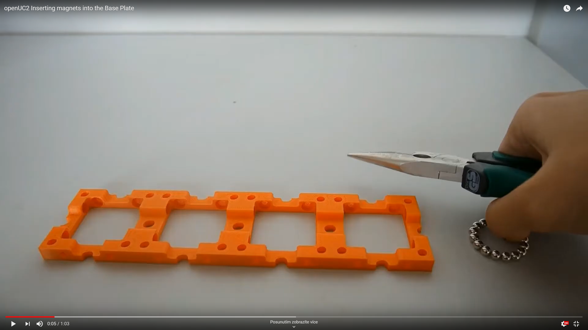

# Baseplate
This is the repository for the design of the baseplates. The .stl files can be found in the folder [STL](./STL).

([TUT04 of TUTORIALS](../../../TUTORIALS))

## Purpose
Baseplates serve as a spine of any setup you build using the cubes. The basic unit has a size of 1×1. The 5 mm ballmagnets are inserted in the baseplate.

Most useful baseplates are 4×1, 4×2 and 4×4. But any size or shape can be concatenated. For better stability, the printed baseplate can be screwed to a Thorlabs breadboard, optical table or a wooden board.

The baseplates can be aslo concatenated in 90° using the Baseplate Connector. This allows you to build setups in 3D!

###  3D printing parts
In [STL](./STL) you find the following baseplates. Choose the size that will be the best for your setup:
* [Assembly_base_4x1](./STL/Assembly_base_4x1.stl)
* [Assembly_base_4x2](./STL/Assembly_base_4x2.stl)
* [Assembly_base_4x4](./STL/Assembly_base_4x4.stl)

Further, you find there:
* [10_Base_v2](./STL/10_Base_v2.stl) - a single baseplate unit. Use it to create assemblies and generate baseplates of different size and shape.
* [00_Connector_Baseplate](./STL/00_Connector_Baseplate.stl) - as mentioned above, the connector allows you to build setups in 3D
* [Assembly_Base_Connector_4](./STL/Assembly_Base_Connector_4.stl) - lenght of 4 baseplate units

###  Additional parts

* Ballmagnets (four magnets per baseplate unit) - 5 mm diameter [🢂](https://www.magnetmax.de/Neodym-Kugelmagnete/Magnetkugel-Kugelmagnet-O-5-0-mm-Neodym-vernickelt-N40-haelt-400-g::158.html)

## Assembly Video Tutorial

##  Assembly Tutorial with images

1. All parts for this model. Here, v0 parts are shown, but the principle of the baseplate assembly haven't changed.

2. Place the magnets on the screws and center the cube on the Base

3. Apply some force to press-fit the magnets into their corresponding holes. Hint: Do it one by one, always putting most pressure on one corner

4. Done!

