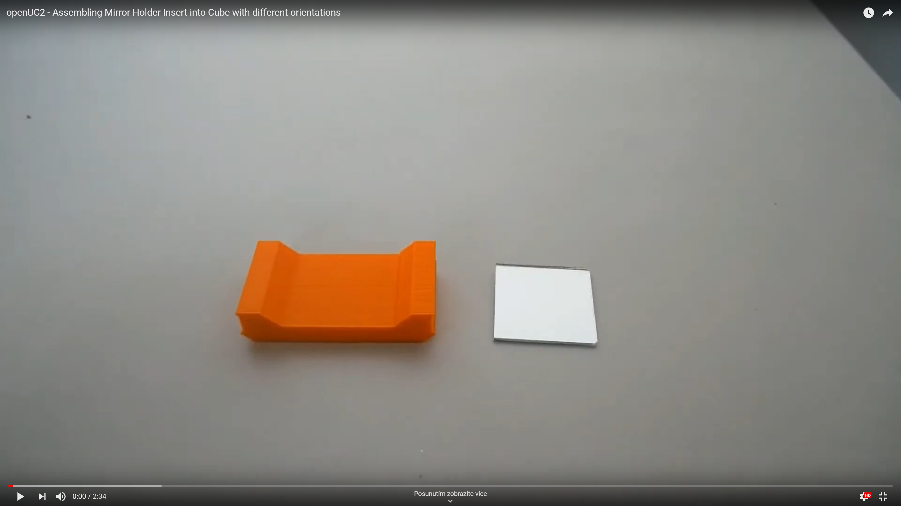

# Mirror Holder Cube
This is the repository for the Adjustable Mirror Holder Cube.

The stl-files can be found in the folder [STL](./STL).

## Purpose
It adapts a 30×30 mm ² fold-mirror to the UC2 system. Alternatively, we also have a design for a 1-inch mirror holder.
Old Image:

Due to limited space, we need to fold the beam using a mirror. This is done by reflecting the incoming light under an angle of 45°. It follows in a change of the optical axis by 90°

### Properties
* design is derived from the base-cube
* the adapter holds a 30×30 mm ² toy-mirror or a 1 inch circular mirror (e.g. Thorlabs part) at 45 degrees in a UC2 base cube
* the here used mirror has the following parameters:
	* Diameter: 25,4mm
	* Reflectance
	* Surface Flatness: (Peak to Valley) λ/10 @ 633 nm
	* Substrate Fused: Silica
	* Thickness: 6.0 mm (0.24")

## Parts

###  3D printing parts
* No support needed in all designs
* Carefully remove all support structures (if applicable)

The Cube consists of the following components.

* **The Lid** where the Arduino + Electronics finds its place ([LID](./STL/10_Lid_1x1_v2.stl))
* **The Cube** which will be screwed to the Lid. Here all the functions (i.e. Mirrors, LED's etc.) find their place ([BASE](./STL/10_Cube_1x1_v2.stl))
* **The Mirror Insert** which holds a 1-inch Mirror from Thorlabs ([INSERT](./STL/20_Cube_Insert_Mirror_Holder_30x30Mirror_v2.stl)) or a 30x30mm Mirror from Amazon ([INSERT](./STL/20_Cube_Insert_Mirror_Holder_v2.stl)) and adapts it to the base cube

###  Additional parts
* Check out the [RESOURCES](../../TUTORIALS/RESOURCES) for more information!
* 8× DIN912 M3×12 screws (galvanized steel) [🢂](https://eshop.wuerth.de/Zylinderschraube-mit-Innensechskant-SHR-ZYL-ISO4762-88-IS25-A2K-M3X12/00843%20%2012.sku/de/DE/EUR/)
* 1× Thorlabs PF10-03-P01 - Protected Silver Mirror [🢂](https://www.thorlabs.com/newgrouppage9.cfm?objectgroup_id=903)
* or 1× 30×30 Mirror from Amazon [🢂](https://www.amazon.de/Rayher-14548606-Spiegelmosaik-selbstklebend-SB-Btl/dp/B008KJ8438/ref=pd_bxgy_201_img_3/258-8761405-4543762?_encoding=UTF8&pd_rd_i=B008KJ8438&pd_rd_r=80fd534c-997b-4a19-b91a-9bf38dbf4ade&pd_rd_w=4DEXV&pd_rd_wg=7SLRE&pf_rd_p=98c98f04-e797-4e4b-a352-48f7266a41af&pf_rd_r=N95R9S45MNSYNQX2BAJE&psc=1&refRID=N95R9S45MNSYNQX2BAJE)

##  Assembly
* Add the mirror to the Insert
* Add the insert to the Cube
* Add the screws to the Cube
* Done!

### Assembly Video Tutorial

### Tutorial with images (30×30 mm² mirror)

1. All parts for this model

2. Stick the mirror to the insert.

3. Put the insert inside the cube and close the lid using the screws.

4. Add screws to the other side of the cube - Done!

## Safety
Don't touch the mirror surface!
